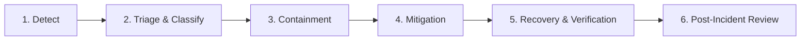
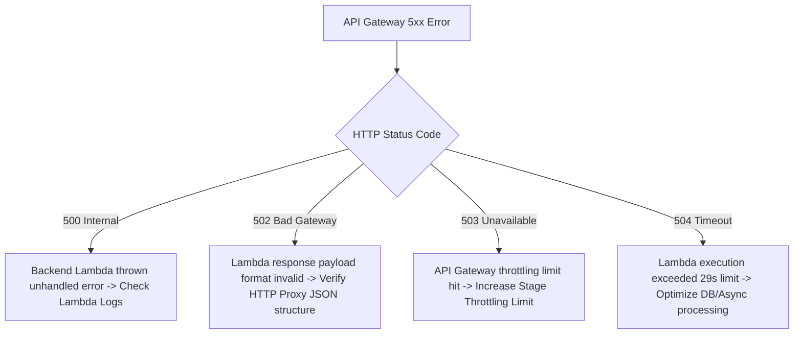

# FreshMart Incident Response Guide

This document defines standard procedures for detecting, triaging, containing, mitigating, and reviewing operational incidents across the FreshMart serverless ecosystem.

---

## 1. Incident Lifecycle Overview



---

## 2. Incident Detection Channels

Incidents enter the response pipeline via three primary channels:

1. **Automated CloudWatch Alarms**:
   - SNS notifications published to `freshmart-dev-customer-events` topic.
   - PagerDuty / Slack `#ops-alarms` integration trigger.
2. **CloudWatch Synthetics Canary Alerts**:
   - Continuous 60-second health check failure alerts on `/admin/health` or `/products`.
3. **User & Customer Support Reports**:
   - Escalations submitted via Slack `#ops-support` or Zendesk support tickets.

---

## 3. Triage Procedures

When an incident is reported or paged, the On-Call Engineer must follow this immediate triage sequence:

```
[Step 1: Acknowledge Page] ---> [Step 2: Check Dashboard] ---> [Step 3: Isolate Blast Radius] ---> [Step 4: Set Severity]
```

### Triage Step-by-Step Checklist
1. **Acknowledge PagerDuty / Slack Alert**: Stop auto-escalation timer within 15 minutes.
2. **Open Observatory Dashboard**: Navigate to CloudWatch Dashboard `FreshMart-dev-observability`.
3. **Identify Failing Component**:
   - Is `API Gateway 5XX` elevated? Check route status in API Gateway logs.
   - Are `Lambda Errors` elevated? Determine which of the 11 microservices is throwing exceptions.
   - Are `DynamoDB Throttles` present? Check table read/write capacity metrics.
   - Is `SQS DLQ` depth > 0? Inspect dead-letter messages.
4. **Classify Severity**: Assign P1, P2, P3, or P4 based on customer impact.
5. **Establish Incident Commander (IC)**:
   - For **P1/P2**: Primary On-Call Engineer assumes IC role, opens Slack war room `#incident-YYYYMMDD-<service>`.

---

## 4. Severity Classification & Response Timelines

| Severity | Customer Impact Criteria | Incident Commander | Response SLA | Status Update Frequency |
| :--- | :--- | :--- | :--- | :--- |
| **P1** | Core ordering, payment, or auth flow down; API 5xx >5% | Primary On-Call + Lead Backend | < 15 mins | Every 15 mins |
| **P2** | Non-core feature failure; latency >2s; CloudFront 5xx >1% | Primary On-Call | < 30 mins | Every 30 mins |
| **P3** | Background processing delay (SQS backlog); non-critical API bug | Primary On-Call | < 2 hours | Every 2 hours |
| **P4** | Low-priority administrative bug; minor cosmetic issue | Assigned Developer | < 24 hours | Daily |

---

## 5. Communication Plan

### Incident Roles
- **Incident Commander (IC)**: Coordinates technical response, assigns diagnostic tasks, approves code changes or rollbacks.
- **Tech Lead**: Executes deep code debugging and infrastructure adjustments.
- **Communications Lead**: Maintains internal Slack announcements and public status page updates.

### Internal Communication Channel
- Slack Channel: `#ops-incidents`
- Executive Escalation Channel: `#ops-leadership`

---

## 6. Resolution Procedures by Service

### 6.1 Lambda Failure Triage

#### Symptoms
- `freshmart-dev-{service}-lambda-errors` alarm firing.
- HTTP 500 / 502 returned to API Gateway clients.

#### Step-by-Step Diagnostic & Resolution
1. **Run CloudWatch Log Insights Query**:
   ```sql
   fields @timestamp, @message
   | filter @message like /ERROR/ or @message like /Exception/
   | sort @timestamp desc
   | limit 20
   ```
2. **Common Root Causes & Fixes**:
   - **Unhandled JS Exception / Syntax Error**: Review recent deployment commit. If code bug exists, issue git revert or hotfix.
   - **Lambda Memory Exhaustion (OOM)**: Inspect `maxMemoryUsed` vs memory allocation. Increase memory in Terraform (`memory_size = 1024`).
   - **Lambda Timeout (>30s)**: Check if downstream DynamoDB or network calls are hanging. Verify connection timeouts.
   - **IAM Role Permission Denied**: Check for `AccessDeniedException` in logs. Verify IAM role policy permissions in `terraform/environments/dev/locals.tf`.

---

### 6.2 API Gateway 5xx Triage

#### Symptoms
- `freshmart-dev-api-5xx` alarm firing.
- API Gateway returns HTTP 500, 502, 503, or 504.

#### Error Code Breakdown & Actions



1. **Verify Lambda Payload Format (502 Fix)**:
   Ensure Lambda return payload matches API Gateway HTTP API v2 format:
   ```json
   {
     "statusCode": 200,
     "headers": { "Content-Type": "application/json" },
     "body": "{\"message\": \"success\"}"
   }
   ```

---

### 6.3 DynamoDB Throttling Response

#### Symptoms
- `freshmart-dev-{table}-ddb-read-throttle` or `ddb-write-throttle` alarm firing.
- Lambda execution duration spiking due to SDK retries.

#### Resolution Steps
1. **Check Table Capacity Mode**:
   Verify if table is set to On-Demand capacity in Terraform (`billing_mode = "PAY_PER_REQUEST"`).
2. **Detect Partition Hot Key**:
   In AWS DynamoDB Console -> Tables -> `{table_name}` -> Metrics -> Read/Write Throttle Events by Partition.
3. **Immediate Mitigation**:
   - If provisioned capacity was exceeded, temporarily increase WCU/RCU via AWS CLI:
     ```bash
     aws dynamodb update-table --table-name freshmart-dev-orders --billing-mode PAY_PER_REQUEST
     ```
   - If hot key partition failure, modify application partition key hashing strategy.

---

### 6.4 SQS / DLQ Backlog Triage

#### Symptoms
- `freshmart-dev-{queue}-dlq-messages` alarm firing (messages visible in DLQ).
- Background notifications or analytics events missing.

#### Resolution Steps
1. **Inspect Dead-Letter Queue**:
   Receive and view sample dead-letter messages without deleting them:
   ```bash
   aws sqs receive-message --queue-url https://sqs.ap-southeast-1.amazonaws.com/769044546162/freshmart-dev-inventory-processing-dlq --max-number-of-messages 5
   ```
2. **Identify Root Cause**:
   Check body for malformed JSON payloads, schema mismatches, or downstream service connection failures.
3. **Execute Redrive (Move Messages Back to Main Queue)**:
   After fixing the code bug, redrive messages from DLQ back to processing queue:
   ```bash
   aws sqs start-message-move-task \
     --source-arn arn:aws:sqs:ap-southeast-1:769044546162:freshmart-dev-inventory-processing-dlq \
     --destination-arn arn:aws:sqs:ap-southeast-1:769044546162:freshmart-dev-inventory-processing
   ```

---

### 6.5 EventBridge Failure Diagnosis

#### Symptoms
- `freshmart-dev-eb-{rule}-failed` alarm firing.
- EventBridge rule `FailedInvocations` > 0.

#### Resolution Steps
1. **Check Event Pattern & Target Permissions**:
   Verify target SNS topic permissions allow EventBridge publishing.
2. **Test Event Pattern Match**:
   Validate event JSON payload against rule filter in AWS Console or CLI:
   ```bash
   aws events test-event-pattern \
     --event-pattern "{\"source\":[\"freshmart.order-service\"],\"detail-type\":[\"order.created\"]}" \
     --event "{\"source\":\"freshmart.order-service\",\"detail-type\":\"order.created\",\"detail\":{}}"
   ```

---

### 6.6 CloudFront Issue Resolution

#### Symptoms
- `freshmart-dev-{app}-cf-5xx` or `cf-4xx` alarm firing.
- Frontend web applications (`customer` or `admin`) showing 502/503 or white screen.

#### Resolution Steps
1. **Check Origin S3 Bucket Access**:
   Ensure origin S3 bucket policy permits CloudFront Origin Access Control (OAC).
2. **Create Edge Cache Invalidation**:
   If broken bundle JS files were cached at edge:
   ```bash
   aws cloudfront create-invalidation --distribution-id <DISTRIBUTION_ID> --paths "/*"
   ```

---

### 6.7 Cognito Outage Response

#### Symptoms
- API Gateway returning HTTP 401 Unauthorized for valid requests.
- `auth-service` failing to exchange authorization codes or issue JWTs.

#### Resolution Steps
1. **Verify Cognito User Pool Status**:
   Check AWS Service Health Dashboard for `ap-southeast-1` Cognito availability.
2. **Verify JWKS Endpoint Reachability**:
   Test JWKS public keys retrieval:
   ```bash
   curl -I https://cognito-idp.ap-southeast-1.amazonaws.com/<USER_POOL_ID>/.well-known/jwks.json
   ```
3. **User Account Lockout Recovery**:
   Unlock locked customer/admin user account:
   ```bash
   aws cognito-idp admin-enable-user --user-pool-id <USER_POOL_ID> --username <USER_EMAIL>
   ```

---

## 7. Rollback Procedures

If a deployment introduces a critical defect, follow the standardized rollback process:

```
[1. Freeze CI/CD Pipeline] ---> [2. Trigger Git Revert] ---> [3. Re-deploy via CD] ---> [4. Verify Baseline]
```

### Rollback Verification Checklist
- [ ] Confirm git revert commit is created on main branch.
- [ ] Ensure GitHub Actions / CD pipeline deploys previous known-good Lambda ZIP artifacts.
- [ ] Verify API Gateway routes respond with HTTP 200 OK.
- [ ] Check CloudWatch Dashboard to confirm `Lambda Errors` returns to 0.

---

## 8. Post-Incident Review (PIR) Template

Copy and fill this template for all P1/P2 Post-Incident Reviews:

```markdown
# Post-Incident Review: [INCIDENT TITLE]

## Incident Summary
- **Date & Time**: YYYY-MM-DD HH:MM SGT
- **Severity**: P1 / P2
- **Incident Commander**: [NAME]
- **Services Affected**: [LIST SERVICES]
- **Total Downtime**: XX minutes
- **Customer Impact**: [NUMBER OF AFFECTED USERS / TRANSACTIONS]

## Executive Summary
Brief paragraph summarizing what happened, why it happened, and how it was resolved.

## Incident Timeline (All times SGT)
- **14:00**: Alarm `freshmart-dev-order-service-lambda-errors` triggered.
- **14:05**: On-Call engineer acknowledged page and opened war room.
- **14:15**: Root cause identified as malformed JSON in Order Service payload.
- **14:25**: Hotfix deployed via CD pipeline.
- **14:30**: Error rates returned to baseline. Incident resolved.

## Root Cause Analysis (5 Whys)
1. Why did the API fail? Order Service Lambda crashed with JSON parsing error.
2. Why did it crash? An optional payload field was accessed without null check.
3. Why was null check missing? Unit test coverage did not include empty payload edge case.
4. Why was test missing? Feature was rushed without complete PR checklist validation.
5. Why did PR pass? Automated code coverage guardrail was missing on PR pipeline.

## Action Items
| ID | Action Item Description | Type | Owner | Target Date | Jira Ticket |
| :--- | :--- | :--- | :--- | :--- | :--- |
| 1 | Add null check in Order handler | Fix | @engineer | YYYY-MM-DD | OPS-101 |
| 2 | Enforce 85% PR code coverage guardrail | Prevent | @devops | YYYY-MM-DD | OPS-102 |
```
