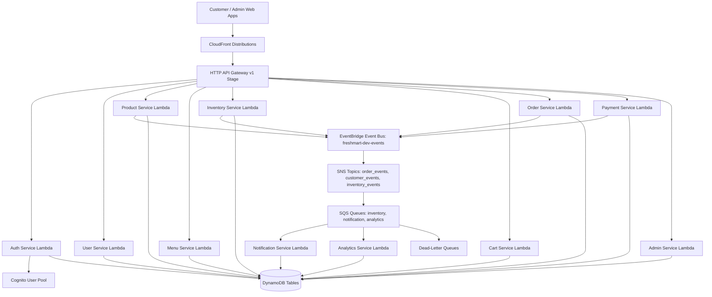

# FreshMart Phase 20.1 Operations Manual

## 1. System Overview

FreshMart is an enterprise serverless backend deployed in AWS `ap-southeast-1` (Singapore) providing e-commerce APIs for grocery ordering, inventory tracking, payment processing, catalog management, and analytics.

### Architecture Overview



### Core Components
- **HTTP API Gateway (`freshmart-dev-api`)**: Serves as the single API entrypoint with JWT authorization backed by Cognito.
- **11 Microservices (Node.js 22.x / Lambda)**: `auth`, `user`, `product`, `menu`, `inventory`, `cart`, `order`, `payment`, `notification`, `analytics`, `admin`.
- **11 DynamoDB Tables**: Point-in-time recovery enabled, single-table design patterns, GSI configurations.
- **EventBridge Event Bus (`freshmart-dev-events`)**: Asynchronous domain event routing for order, payment, inventory, customer events.
- **SNS Topics & SQS Processing Queues**: Fan-out routing with dedicated SQS queues and attached SQS Dead-Letter Queues (DLQs).
- **Cognito User Pool**: Identity provider handling JWT authentication, MFA, and RBAC (admins, staff, customers).
- **CloudFront & S3**: Static web asset distribution (`customer-web`, `admin-web`) and shared object storage.

---

## 2. Dashboard Reading Guide

The primary operational dashboard is **`FreshMart-dev-observability`** in CloudWatch.

### Key Widgets & Baseline Operational Ranges

| Widget Title | Metric Source | Expected Normal Baseline | Visual Warning Signs | Operational Meaning & Inspection |
| :--- | :--- | :--- | :--- | :--- |
| **Lambda Errors** | `AWS/Lambda Errors` (Sum) | 0 errors per 5-min period | Any spikes >0 | Indicates unhandled exceptions, syntax crashes, or external service failure. Check Lambda log stream immediately. |
| **Lambda Duration** | `AWS/Lambda Duration` (Average) | 50ms – 300ms | Average >1000ms or p95 >2500ms | Signals database query slowness, cold start delays, or downstream network bottlenecks. |
| **Lambda Throttles** | `AWS/Lambda Throttles` (Sum) | 0 throttles | Any value >0 | Indicates regional/account concurrency limits hit or reserved concurrency exhaustion. |
| **API Gateway 5XX** | `AWS/ApiGateway 5XXError` (Sum) | 0 errors | Any count ≥1 | Severest edge indicator. Distinguish between 500 (Lambda bug), 502 (Lambda crash/format error), 504 (timeout >29s). |
| **API Gateway Latency** | `AWS/ApiGateway Latency` (Average) | <200ms | Average >500ms | End-to-end API response time including network, API Gateway processing, and Lambda integration execution. |
| **DynamoDB Read Throttle** | `AWS/DynamoDB ReadThrottleEvents` (Sum) | 0 events | Any count ≥1 | Partition key hotness or provisioned read throughput limits breached. |
| **DynamoDB Write Throttle**| `AWS/DynamoDB WriteThrottleEvents` (Sum) | 0 events | Any count ≥1 | Write capacity exceeded; causes immediate Lambda transaction retries and potential API 5xx spikes. |
| **CloudFront Error Rates** | `AWS/CloudFront 4xxErrorRate / 5xxErrorRate` | <0.1% | 5xx >1%, 4xx >5% | Static frontend delivery failure, origin S3 access denied, or invalid edge caching. |
| **SQS Queue & DLQ Depth** | `AWS/SQS ApproximateNumberOfMessagesVisible` | 0 in DLQ, <100 in Queue | DLQ >0 or Queue Age >300s | Async background consumer (Notification/Analytics/Inventory) failed or stuck processing messages. |

---

## 3. Alarm Response Matrix Overview

Alarms in FreshMart are categorized into four severity tiers:

```
+-----------------------------------------------------------------------+
|  P1 - CRITICAL  | Core customer flow down (Orders, Payments, Auth API) |
+-----------------------------------------------------------------------+
|  P2 - HIGH      | Non-critical flow impacted, elevated error/latency   |
+-----------------------------------------------------------------------+
|  P3 - MEDIUM    | Degraded async queue, low-level error spikes          |
+-----------------------------------------------------------------------+
|  P4 - LOW       | Informational, near-capacity, minor warning           |
+-----------------------------------------------------------------------+
```

*For the complete detailed alarm lookup table across all 87 alarms, consult [alarm_matrix.md](file:///c:/Users/mathankumar.n/Downloads/projects/freshmart-serverless-backend/docs/alarm_matrix.md).*

---

## 4. Incident Severity Classification

| Severity Level | Definition & Criteria | Target Acknowledge | Resolution SLA | Update Frequency | Example Scenarios |
| :--- | :--- | :--- | :--- | :--- | :--- |
| **P1 - Critical** | Core ordering/payment flow is completely blocked or >5% of all customer requests fail. Auth service completely down. | < 15 minutes | < 2 hours | Every 15 mins | API Gateway returning >5% 5xx; Order/Payment Lambda failing continuously; Cognito User Pool unreachable. |
| **P2 - High** | Degradation of primary feature; P95 latency >2000ms; single service failing (e.g., Product update fails, Cart slowness); CloudFront 5xx >1%. | < 30 minutes | < 4 hours | Every 30 mins | DynamoDB Write throttling on Orders table; Menu Lambda average duration >3s; SQS DLQ accumulating messages rapidly. |
| **P3 - Medium** | Non-critical feature impacted; background worker slowness; SQS message age >300s; 4xx error rate spike >5%. | < 2 hours | < 24 hours | Every 2 hours | Analytics queue backlog accumulating; Admin service health check warning; minor background notification delivery lag. |
| **P4 - Low** | Minor cosmetic issue, non-blocking bug in admin portal, single cold-start latency spike, minor documentation or warning threshold. | < 24 hours | Next sprint | Daily | Single Lambda throttle event during peak deployment; non-impacting CloudWatch log metric anomaly. |

---

## 5. On-Call Procedures

### Shift Handoff Protocol
- Handoff takes place every **Monday at 09:00 SGT**.
- Incoming On-Call engineer must review:
  1. Open operational alerts and silence/maintenance schedules.
  2. Active P1-P4 incidents from the previous week.
  3. Scheduled deployments and infrastructure changes for the week.
  4. Verify access to PagerDuty, AWS Console (`freshmart-dev`), and Slack `#ops-alarms`.

### Active Incident Protocol
1. **Acknowledge**: On-Call engineer acknowledges alert within SLA (P1 <15m, P2 <30m).
2. **Triage**: Isolate failing service via CloudWatch Dashboard and CloudWatch Log Insights.
3. **Declare & Communicate**: Post initial incident notice on Slack `#ops-incidents` and update status page if customer-facing.
4. **Mitigate**: Execute corresponding procedure in [runbook.md](file:///c:/Users/mathankumar.n/Downloads/projects/freshmart-serverless-backend/docs/runbook.md) or issue pipeline rollback.
5. **Verify**: Ensure error metrics fall back to baseline.
6. **Close & PIR**: Document resolution and schedule Post-Incident Review for P1/P2 incidents.

---

## 6. Escalation Matrix

| Level | Role / Contact | Trigger Condition | SLA Target | Responsibilities |
| :--- | :--- | :--- | :--- | :--- |
| **Level 1** | Primary On-Call Engineer | Alarm trigger / Initial incident page | Ack < 15m | First responder, triage, initial containment, executing runbooks. |
| **Level 2** | Secondary On-Call / Lead Backend Engineer | Unresolved after 30m (P1) or 60m (P2); multi-service impact | Response < 15m | Deep technical diagnosis, code fixes, hotfix deployment authorization. |
| **Level 3** | Principal Architect & Engineering Director | Unresolved after 60m (P1); data loss risk; major outage | Immediate | Executive comms, resource reallocation, vendor escalation (AWS Support). |
| **External** | AWS Enterprise Support / Identity Vendor | AWS infrastructure outage (DynamoDB region issue, APIGW edge failure) | Case SLA < 15m | Submitting Business/Enterprise Support Case via AWS Support Center. |

---

## 7. Service Level Objectives (SLOs)

FreshMart tracks the following strict SLOs across rolling 30-day windows:

| Metric | Target SLO | Error Budget (30-day) | Monitoring Metric | Alerting Threshold |
| :--- | :--- | :--- | :--- | :--- |
| **API Availability** | **≥ 99.9%** | 43 minutes 49 seconds downtime | `ApiGateway 5XXError / Count` | > 0.1% over 5m window |
| **P95 API Latency** | **< 500ms** | 5% requests > 500ms | `ApiGateway Latency` (p95) | > 500ms over 15m window |
| **Error Budget** | **< 0.1%** total requests | Max 0.1% failed requests | Combined API Gateway 5xx rate | > 0.05% burn rate |
| **Lambda Error Rate** | **< 0.01%** | Max 1 error per 10,000 invocations | `Lambda Errors / Invocations` | > 0.01% over 10m window |
| **API 5xx Rate** | **< 0.1%** | Max 1 5xx error per 1,000 requests | `ApiGateway 5XXError` | ≥ 1 error count |
| **CloudFront Availability**| **≥ 99.95%** | 21 minutes 54 seconds downtime | `CloudFront 5xxErrorRate` | > 0.05% over 5m window |

---

## 8. Communication Templates

### 1. Status Page Initial Alert (Investigating)
```text
[INVESTIGATING] Increased Error Rates on FreshMart Ordering API

We are currently investigating reports of elevated error rates affecting the FreshMart ordering and checkout workflow. 

Impact: Customers may experience errors or delays when placing orders or viewing active carts.
Current Status: Engineering teams have responded and are triaging the issue.
Next Update: Within 15 minutes.
```

### 2. Status Page Progress Update (Identified)
```text
[IDENTIFIED] Elevated Latency in Payment Processing Service

The root cause of the current checkout failure has been identified as upstream payment gateway throttling. We are adjusting retry parameters and scaling processing capacity.

Impact: Order confirmations may take up to 30 seconds to complete.
Current Status: Fix is being applied and verified.
Next Update: Within 30 minutes.
```

### 3. Status Page Resolution Notice (Resolved)
```text
[RESOLVED] FreshMart Ordering API Fully Operational

The issue causing elevated 5xx errors on order creation has been fully resolved. All background processing queues have caught up, and API response times have returned to normal baseline (<200ms).

Time of Incident: 14:15 SGT - 14:42 SGT
Root Cause: Cold-start latency and DynamoDB capacity bottleneck during flash traffic peak.
Action Taken: Adjusted Provisioned Concurrency and auto-scaling rules.
```

---

## 9. Post-Incident Review (PIR) Process

FreshMart adheres to a **blameless post-incident review culture**.

### PIR Timeline & Requirements
- **Mandatory Trigger**: All P1 and P2 incidents require a formal PIR.
- **Completion SLA**: Draft completed within **48 hours**; review meeting held within **5 business days**.
- **PIR Owner**: Primary On-Call Engineer during the incident.

### PIR Action Item Tracking Rules
1. Every action item must have a single assigned owner and target completion date.
2. P1 PIR action items must be scheduled into the current or immediate next sprint.
3. Action items are tracked in Jira under the `OPS-PIR` component and reviewed weekly.
