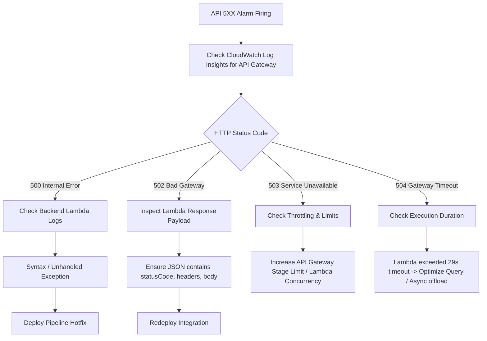

# FreshMart Operational Runbook

This runbook provides actionable step-by-step procedures for operating, troubleshooting, and recovering FreshMart serverless infrastructure in `ap-southeast-1`.

---

## 1. API Gateway 5xx Triage Flowchart & Procedures

### Diagnostic Flowchart



### Step-by-Step Diagnostic Execution

1. **Query API Gateway Access Logs**:
   ```sql
   fields @timestamp, requestTime, httpMethod, path, status, responseLength, integrationLatency
   | filter status >= 500
   | sort @timestamp desc
   | limit 20
   ```

2. **Locate Target Lambda Log Stream**:
   Retrieve the `extendedRequestId` or `requestId` from the API log, then search the corresponding Lambda log group `/aws/lambda/freshmart-dev-<service>-service`.

---

## 2. DLQ Message Investigation and Redrive Steps

FreshMart deploys dedicated SQS Dead-Letter Queues (DLQs) for asynchronous workers:
- `freshmart-dev-inventory-processing-dlq`
- `freshmart-dev-notification-processing-dlq`
- `freshmart-dev-analytics-processing-dlq`

### Step 1: Detect & Peek DLQ Messages
When `freshmart-dev-{queue}-dlq-messages` alarm fires:
```bash
aws sqs receive-message \
  --queue-url https://sqs.ap-southeast-1.amazonaws.com/769044546162/freshmart-dev-inventory-processing-dlq \
  --attribute-names All \
  --message-attribute-names All \
  --max-number-of-messages 5
```

### Step 2: Analyze Payload & Root Cause
Examine the `Body` JSON and `Attributes` (e.g., `ApproximateReceiveCount`). Common causes:
- Downstream service temporary unavailability.
- Malformed message payload structure (JSON validation error).

### Step 3: Redrive Messages Back to Processing Queue
Once the underlying code bug or downstream service is fixed, trigger SQS message redrive:
```bash
aws sqs start-message-move-task \
  --source-arn arn:aws:sqs:ap-southeast-1:769044546162:freshmart-dev-inventory-processing-dlq \
  --destination-arn arn:aws:sqs:ap-southeast-1:769044546162:freshmart-dev-inventory-processing
```

### Step 4: Verify Redrive Completion
Check move task execution status:
```bash
aws sqs list-message-move-tasks \
  --queue-url https://sqs.ap-southeast-1.amazonaws.com/769044546162/freshmart-dev-inventory-processing-dlq
```

---

## 3. Lambda Cold Start & Performance Mitigation

### Step 1: Detect Cold Start Impact
Use CloudWatch Log Insights to calculate cold-start duration vs warm execution:
```sql
fields @timestamp, @duration, @initDuration
| filter ispresent(@initDuration)
| stats count(*) as ColdStarts, avg(@initDuration) as AvgInitTime, max(@initDuration) as MaxInitTime by bin(5m)
```

### Step 2: Immediate Performance Mitigation
1. **Memory Optimization**: Increasing memory size proportionally increases allocated CPU quota.
   Edit `terraform/environments/dev/locals.tf`:
   ```hcl
   memory_size = 1024  # Upgraded from 512MB to reduce runtime and init time
   ```
2. **Provisioned Concurrency**: For core customer flows (`auth`, `order`, `payment`), configure Provisioned Concurrency via CLI:
   ```bash
   aws lambda put-provisioned-concurrency-config \
     --function-name freshmart-dev-order-service \
     --qualifier live \
     --provisioned-concurrent-executions 5
   ```

---

## 4. SQS Queue Backlog Triage

### Symptoms
- `freshmart-dev-{queue}-age` alarm firing (`ApproximateAgeOfOldestMessage` > 300 seconds).

### Triage & Resolution Procedure
1. **Check Active Worker Concurrency & Batch Size**:
   Review Lambda Event Source Mapping configuration:
   ```bash
   aws lambda list-event-source-mappings \
     --function-name freshmart-dev-inventory-service
   ```
2. **Scale Consumer Processing Speed**:
   - Increase `batch_size` from 10 to 50 in `terraform/environments/dev/main.tf`:
     ```hcl
     resource "aws_lambda_event_source_mapping" "inventory_sqs_trigger" {
       event_source_arn = module.sqs.queue_arn["inventory_processing"]
       function_name    = module.lambda["inventory"].function_name
       batch_size       = 50
       enabled          = true
     }
     ```
   - Re-apply Terraform configuration (`terraform apply`).

---

## 5. EventBridge Rule Failure Diagnosis

### Symptoms
- `freshmart-dev-eb-{rule}-failed` alarm firing (`FailedInvocations` > 0).

### Diagnosis Procedure
1. **Inspect Rule Metrics in CloudWatch**:
   Verify `Invocations`, `FailedInvocations`, and `TriggeredRules` metrics for namespace `AWS/Events`.
2. **Verify Target SNS/SQS Permissions**:
   Check if the SNS topic policy permits EventBridge service principal:
   ```json
   {
     "Sid": "AllowEventBridgePublish",
     "Effect": "Allow",
     "Principal": { "Service": "events.amazonaws.com" },
     "Action": "sns:Publish",
     "Resource": "arn:aws:sns:ap-southeast-1:769044546162:freshmart-dev-order-events"
   }
   ```
3. **Simulate Event Matching**:
   ```bash
   aws events put-events --entries '[{
     "Source": "freshmart.order-service",
     "DetailType": "order.created",
     "Detail": "{\"orderId\":\"test-123\"}",
     "EventBusName": "freshmart-dev-events"
   }]'
   ```

---

## 6. CloudFront Cache Invalidation

### Step 1: Identify Invalidation Scope
If frontend deployment (`customer-web` or `admin-web`) leaves stale cached assets at edge nodes:

### Step 2: Execute Invalidation via AWS CLI
```bash
# Invalidate Customer Web Distribution
aws cloudfront create-invalidation \
  --distribution-id E1A2B3C4D5E6F7 \
  --paths "/*" "/index.html" "/static/*"

# Invalidate Admin Web Distribution
aws cloudfront create-invalidation \
  --distribution-id E7F6E5D4C3B2A1 \
  --paths "/*" "/index.html"
```

### Step 3: Monitor Invalidation Status
```bash
aws cloudfront get-invalidation \
  --distribution-id E1A2B3C4D5E6F7 \
  --id I1J2K3L4M5N6O7
```

---

## 7. Cognito User & Identity Management

### Procedure 1: Unlock Locked User Account
If a customer or staff user is locked due to failed authentication attempts:
```bash
aws cognito-idp admin-enable-user \
  --user-pool-id ap-southeast-1_XXXXX \
  --username user@example.com
```

### Procedure 2: Reset User Password (Admin-Initiated)
```bash
aws cognito-idp admin-reset-user-password \
  --user-pool-id ap-southeast-1_XXXXX \
  --username user@example.com
```

### Procedure 3: Assign User to RBAC Group (`admins`, `staff`, `customers`)
```bash
aws cognito-idp admin-add-user-to-group \
  --user-pool-id ap-southeast-1_XXXXX \
  --username admin@freshmart.com \
  --group-name freshmart-dev-admins
```

### Procedure 4: Global User Sign-Out (Security Revocation)
Revoke all active refresh tokens for a compromised account:
```bash
aws cognito-idp admin-user-global-sign-out \
  --user-pool-id ap-southeast-1_XXXXX \
  --username compromised@example.com
```